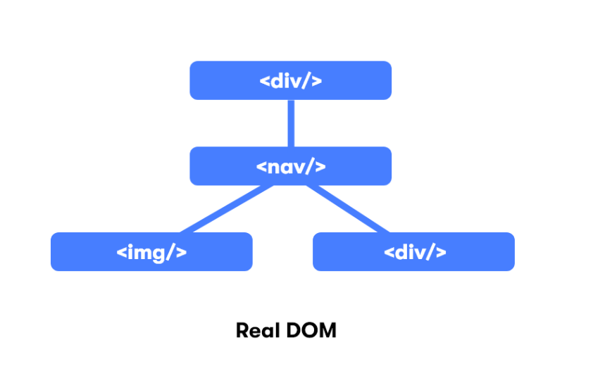
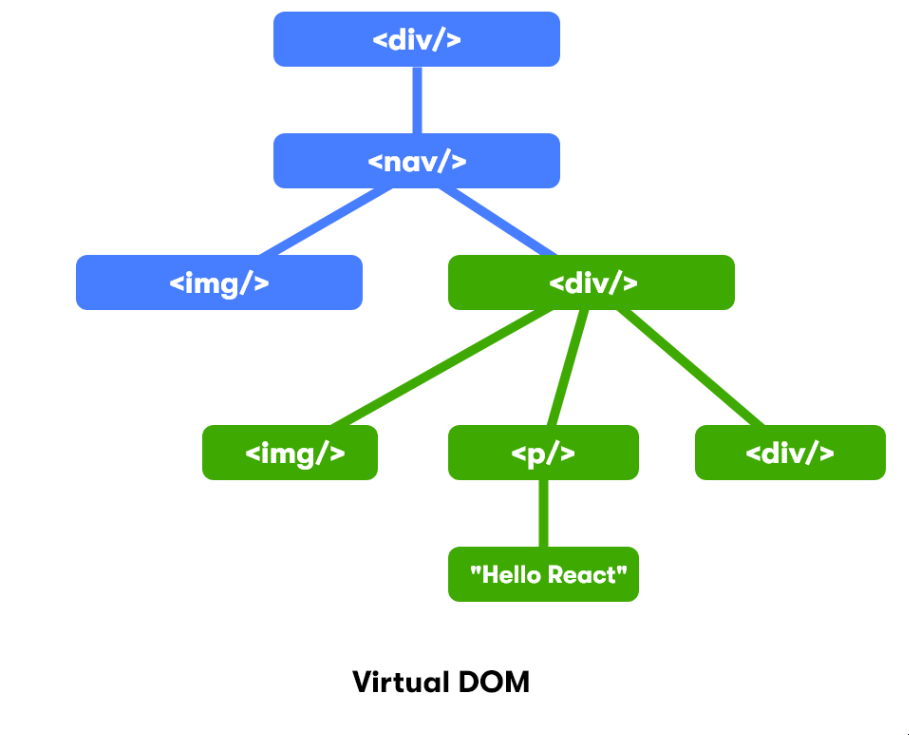

# Stateful Components

## Virtual DOM

The virtual DOM (VDOM) is a programming concept where an ideal, or “virtual”, representation of a UI is kept in memory and synced with the “real” DOM by a library such as ReactDOM. This process is called [reconciliation](https://reactjs.org/docs/reconciliation.html).Internally, React uses objects called fibers to keep more details of the component tree.

real-dom            |  vdom
:-------------------------:|:-------------------------:
  | 

## Hooks 

Hooks allow function components to have access to state and other React features.

Hooks are a new-ish feature in React. You may find older tutorials that don't use Hooks, but don't panic. The concepts we learn here are the same whether or not you use Hooks. We are looking at Hooks first because they are simpler to learn for beginners.

## Rules of Hooks

- Only Call Hooks at the Top Level

Don’t call Hooks inside loops, conditions, or nested functions. Instead, always use Hooks at the top level of your React function, before any early returns.

- Only Call Hooks from React Functions
Don’t call Hooks from regular JavaScript functions. Instead, you can:

  - Call Hooks from React function components.
  - Call Hooks from custom Hooks

## UseState 

The `useState()` hook sets up an individual state property. It returns an array containing two elements: the current state value, and a function you can call with a new value to update the state.

When we destructure an array, we can name the variables whatever we want, but there is a naming convention when destructuring the `useState` array. The first variable should be named whatever your state is called, and the second variable should be the same name but prefixed with `set`.

```js
const [userIsLoggedIn, setUserIsLoggedIn] = useState(false);

const [username, setUsername] = useState("chris");

const [unreadMessages, setUnreadMessages] = useState(5);

````

more on [usestate](https://syllabus.codeyourfuture.io/react/week-2/lesson#importing-usestate)

## UseEffect

A functional React component uses props and/or state to calculate the output. If the functional component makes calculations that don't target the output value, then these calculations are named **side-effects**.

Examples of side-effects are fetch requests, manipulating DOM directly, using timer functions like `setTimeout()`, and more.

>The component rendering and side-effect logic are independent. It would be a mistake to perform side-effects directly in the body of the component, which is primarily used to compute the output.

more on [useeffect](https://reactjs.org/docs/hooks-reference.html#useeffect)


## component lifecycle

Lifecycle in React is  about a component getting created, updated, and destroyed.

Functional components are the more modern option for creating components, but since functions can't hold their own properties, hooks were introduced, which allow a function component to reference specific state with useState() or "hook" into the component lifecycle with useEffect().


